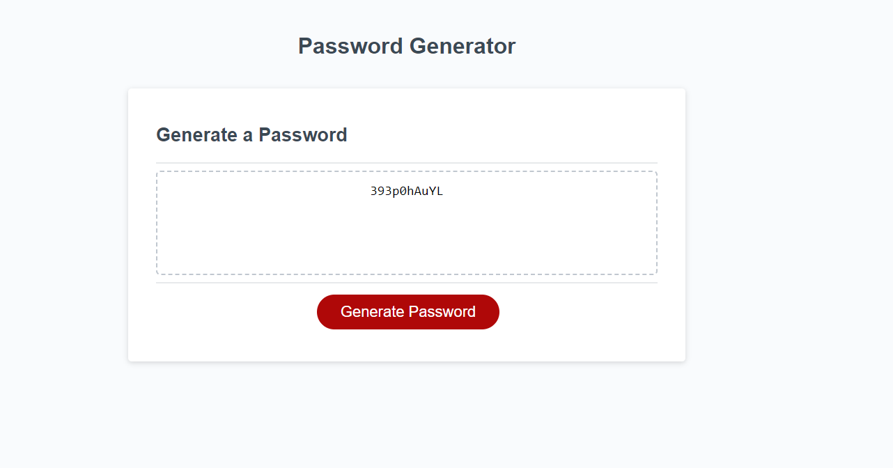

# Password Generator Starter Code

## About
I learned a lot about how to impliment javascript with this application.  The trickiest part for me was how to take the prompts that were yes and no questions and to convert those into useable code.  I converted it into boolean values which I was able to manipulate later in the code with if statements to tell the code wether or not to include the upper case, lower case, symbols or numbers. In earlier drafts, I was trying to manipulate codes that I researched with little luck and decided to scratch it and go with a much more simplistic method to complete the task. 

## Links
Git Hub Repository: https://github.com/erinsawyer504/purple-password-generator

Deployed Website: https://erinsawyer504.github.io/purple-password-generator/


## Your Task

This week's Challenge requires you to modify starter code to create an application that enables employees to generate random passwords based on criteria that they’ve selected. This app will run in the browser and will feature dynamically updated HTML and CSS powered by JavaScript code that you write. It will have a clean and polished, responsive user interface that adapts to multiple screen sizes.

The password can include special characters. If you’re unfamiliar with these, see this [list of password special characters](https://www.owasp.org/index.php/Password_special_characters) from the OWASP Foundation.

## User Story

```
AS AN employee with access to sensitive data
I WANT to randomly generate a password that meets certain criteria
SO THAT I can create a strong password that provides greater security
```

## Acceptance Criteria

```
GIVEN I need a new, secure password
WHEN I click the button to generate a password
THEN I am presented with a series of prompts for password criteria
WHEN prompted for password criteria
THEN I select which criteria to include in the password
WHEN prompted for the length of the password
THEN I choose a length of at least 8 characters and no more than 128 characters
WHEN asked for character types to include in the password
THEN I confirm whether or not to include lowercase, uppercase, numeric, and/or special characters
WHEN I answer each prompt
THEN my input should be validated and at least one character type should be selected
WHEN all prompts are answered
THEN a password is generated that matches the selected criteria
WHEN the password is generated
THEN the password is either displayed in an alert or written to the page
```

## Mock-Up

The following image shows the web application's appearance and functionality:




- - -
© 2022 edX Boot Camps LLC. Confidential and Proprietary. All Rights Reserved.
